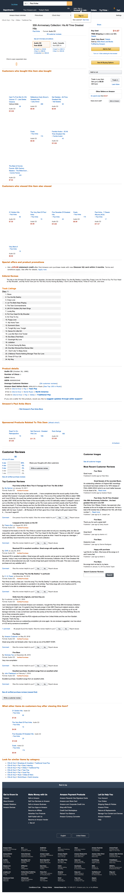

# ISP Data Pollution

Congress's party-line vote will allow ISP's to exploit your family's private data without your consent. See "**[Senate Puts ISP Profits Over Your Privacy](https://www.eff.org/deeplinks/2017/03/senate-puts-isp-profits-over-your-privacy)**".

This script is designed to defeat this violation by generating large amounts of realistic, random web browsing to pollute ISP data and render it effectively useless by obfuscating actual browsing data.

I pay my ISP a lot for data usage every month. I typically don't use all the bandwidth that I pay for. If my ISP is going to sell private browsing habits, then I'm going to pollute browsing with noise and use all the bandwidth that I pay for. This method accomplishes this.

If everyone uses all the data they've paid for to pollute their browsing history, then perhaps ISPs will reconsider the business model of selling customer's private browsing history.

The [alternative](https://arstechnica.com/information-technology/2017/03/how-isps-can-sell-your-web-history-and-how-to-stop-them/) of using a VPN or Tor merely pushes the issue onto to the choice of VPN provider, complicates networking, and adds the real issue of navigating captchas when appearing as a Tor exit node. Also, merely encrypted traffic has too much [exploitable side-channel information](https://www.theatlantic.com/technology/archive/2017/03/encryption-wont-stop-your-internet-provider-from-spying-on-you/521208/), and could still be used to determine when specific family members are at home, and the activities in which they're engaged.

This crawler uses [chromedriver](http://chromedriver.chromium.org) with the Python selenium library, uses blacklists for undesirable websites (see the code for details), does not download images, and respects robots.txt, which all provide good security.

# Command Line

```
python3 isp_data_pollution.py
python3 isp_data_pollution.py --help
python3 isp_data_pollution.py -bw 1024  # 1 TB per month
python3 isp_data_pollution.py -g        # print debugging statements
```

# Motivation for Efficacy

The approach used in this script is susceptible to both statistical attack and traffic anomalies. Jon Brodkin's [article](https://arstechnica.com/information-technology/2017/04/after-vote-to-kill-privacy-rules-users-try-to-pollute-their-web-history/) on privacy through noise injection covers several valid critiques: the approach is not guaranteed to obfuscate sensitive private information, and even if it does work initially, it may not scale. Known flaws and suggestions for improvements are welcomed in the [Issues](../../Issues) pages.

However, there are good information theoretic and probabilistic reasons to suggest an approach like this could work in many practical situations. Privacy through obfuscation has been used in many contexts. In the data sciences, Rubin proposed a statistically sound method to preserve subject confidentiality by masking private data with synthetic data ("[Statistical Disclosure Limitation](http://www.jos.nu/Articles/abstract.asp?article=92461)", *JOS* **9**(2):461–468, 1993). In a nice paper relevant to this repo, Ye et al. describe a client-side privacy model that uses noise injection ("[Noise Injection for Search Privacy Protection](http://web.cs.ucdavis.edu/~hchen/paper/passat2009.pdf)", *Proc. 2009 Intl. Conf. CSE*).

Here are two back-of-the-envelope arguments for the efficacy of this approach in the case of ISP privacy intrusion. These are not proofs, but simple models that suggest some optimism is warranted. Actual efficacy must be determined by testing these models in the real world.

## Information Theoretic Argument

Ye et al.'s approach attempts to minimize the mutual information between user data and user data with injected noise presented to a server. Mutual information is the overlap between the entropy of the user data, and the entropy of the user data with injected noise (purple area below). The amount and distribution of injected noise is selected to make this mutual information as small as possible, thus making it difficult to exploit user data on the server side.


The example in Ye et al.'s paper is specific search queries. The analogy in this repo is specific domains. Domain information is the primary data leaked to ISPs if encrypted HTTPS is used, and is therefore relevant. The case of unencrypted traffic with explicit query terms and content is discussed in the next section on maximum likelihood.

Ye et al. show that the mutual information vanishes if:

> Number of noise calls ≥ (Number of user calls - 1) × Number of possible calls

For this application, the number of possible calls is the number of domains that a user might visit (per day), and the number of calls is the number of visits made. Nielson [reported](http://www.nielsen.com/us/en/insights/news/2010/nielsen-provides-topline-u-s-web-data-for-march-2010.html) in 2010 that the average person visits 89 domains per month. To be extremely conservative in (over)estimating the number of noise calls necessary to obscure this browsing data, assume that the average user visits *O*(100) domains per day, with *O*(200) user requests per day, or about one every five minutes over a long day. 

The equation above asserts that (200-1)×100 or about twenty thousand (20,000) noise calls are required to achieve zero mutual information between user data and the user plus noise data.

This amounts to one noise call about every five seconds, which is very easy to achieve in practice, and easily falls within a nominal bandwidth limit of 50 GB per month.

If Ye et al.'s client-side information theoretic model is valid in practice, then it is reasonable to expect that the parameters chosen in this script would be able to greatly reduce or eliminate the mutual information between actual user domain data and the domain data presented to the ISP.

Furthermore, fewer noise calls may be used if a dependency model is introduced between the user and noise distributions.

## Maximum Likelihood Argument

Unencrypted HTTP calls leak highly specific user data to the ISP. Targeted advertising methods uses this captured data to classify the user and serve tailored advertising based upon the user's category. Probabilistically, this approach inherently depends upon finding specific "peaks" in a users query distribution, then using these peaks to find the most likely consumer categories for the user. Injecting a large number of uncorrelated (or better, anti-correlated) calls may hinder the maximum-likelihood approach used to classify the user because it adds many more peaks throughout the measured distribution of user interests.

Furthermore, the advertiser's transmission bandwidth is highly constrained—only so many ads will fit on a web page. Adding uncorrelated noise calls complicates the problem of selecting the appropriate ad.

# Known Issues

## Critiques of Data Pollution

Both Kaveh Waddell's and Jon Brodkin's excellent articles on ISP privacy in *[The Atlantic](https://www.theatlantic.com/technology/archive/2017/04/hiding-the-signal-in-the-noise/522564/)* and *[Ars Technica](https://arstechnica.com/information-technology/2017/04/after-vote-to-kill-privacy-rules-users-try-to-pollute-their-web-history/)* address important critiques of this approach. These are summarized here along with a response both so that users are aware of these issues, and to prompt suggestions to address them.

- **“Masking a person’s browsing history by layering in copies of other people’s browsing patterns might be more useful. … ‘It would be a Tor-like system where anonymity comes through shared usage.’”** [[Bruce Schneier](https://www.schneier.com)]
  - Comment 1: It is possible to mask privacy with statistical methods (Rubin, op. cit.; Ye et al., op. cit.)
  - Comment 2: A Tor- or I2P-like routing system would be preferable if a good solution to the Tor exit-node problem is found. A sample crawl illustrates that creating self-generated pollution is much, much safer than running a Tor (or Tor-like) exit node that allows anyone to send open requests from a personal IP address.

- **“[Do not underestimate] internet providers’ ability … to see through data-obfuscation tactics.”** [[Bruce Schneier](https://www.schneier.com)]
  - Comment: The bandwidth parameters in this repo are chosen with a specific information theoretic model in mind that, if correct, eliminates the mutual information between user domain data and polluted data presented to the ISP. No mutual information means no big data exploitation opportunity. This is an area where more research is required because flaws/imperfections in the obfuscation method will leak information. Sufficient quantities of correctly chosen noise make big data approaches significantly more challenging. This is a hypothesis that remains to be tested in this context.

- **“Random Google searches could send the program down a dark rabbit hole, without the user’s knowledge.”** [[Kenn White](https://twitter.com/kennwhite)]
  - Comment 1: This is a possibility. It is mitigated by (1) using Google safe searches; (2) an in-memory blacklist; (3) no image downloads. Based on this critique, the explicit parameter `safe=active` is added to search queries.
  - Comment 2: Tor exit-node traffic almost certainly contains such traffic, which is an important issue for exit-node operators. In contrast, self-generated noise is likely to be—and in practice appears to be—much safer.
  - Comment 3: This potential problem has not yet been observed or reported. Reports of such problems or suggestions to further mitigate them are welcomed in the repo's [Issues](../../Issues).
  
- **“Some information is sensitive even if it's surrounded by noise. … Imagine if hackers targeted your ISP, your browsing history was leaked, and it showed you visiting specific controversial websites. … Even if that was surrounded by noise, it would be very hard to get the sort of noise that would give you plausible deniability.”** [[Jeremy Gillula](https://www.eff.org/about/staff/jeremy-gillula)]
  - Comment 1: This is correct. Obfuscation is a statistical approach that cannot conceal highly specific, personal, sensitive data, and would not offer plausible deniability.
  - Comment 2: This is also a potential issue for VPN users.

## Known Limitations of Data Pollution

Analysis of other data obfuscation approaches show susceptibility to off-the-shelf machine learning classifer attacks: Pedinti and Saxena demonstrated meaningful user classification with the TrackMeNot browser plugin intended to defeat an adversarial search engine ("[On the Privacy of Web Search Based on Query Obfuscation: A Case Study of TrackMeNot](http://link.springer.com/chapter/10.1007/978-3-642-14527-8_2)", in *Proc. PETS2010*, 2010). The adversarial model and training methods used in this analysis are not directly applicable to the case of ISP intermediaries. Key features of Pedinti and Saxena's attack are:

- "We set out to investigate whether it is still possible (and to what extent) for an adversarial search engine–equipped with users’ search histories—to filter out TMN queries using off-the-shelf machine learning classifiers and thus undermine the privacy guarantees provided by TMN."
- "The problem considered in this paper is different from the problem of identifying queries from an anonymized search log. First, an adversary in our application is the search engine itself and not a third party attempting to de-anonymize a search log. Second, unlike a third party, the search engine is already in possession of users’ search history using which it can effectively train a classifier."
- "In our *adversarial model*, we assumed that the search engine is adversarial and its goal is to distinguish between TMN and user queries for profiling and aggregation purposes. We also assumed that the engine would have access to user’s search histories for a certain duration until the point the user starts using the TMN software."
- "**Classification Algorithms.** Since clustering with default parameters performed poorly, we decided to work with supervised/classification algorithms which are trained on prior labeled data."
- Amount of noise data comparable to amount of user data because of search engine API limits.

None of these attack features are necessarily applicable to an ISP adversarial model. It is possible that an ISP could use historical unpolluted user data to train a classifier, however, this presumes that users's interests, numbers, and identities at an account IP address do not change from month-to-month, an unlikely event for most users and households. Without uncorrupted user data to train on, this paper illustrates the difficulties of third-party de-anonymization even with limited quantities of noise. It would be useful to quantify classification performance with and without the ability to train with uncorrupted user data. Knowing the answer for both cases would point to potential improvements in the obfuscation approach.

# Privatizing Proxy Filter with VPN Access

Data pollution is one component of privatizing your personal data. Install the [EFF](../../../../EFForg)'s [HTTPS Everywhere](https://www.eff.org/https-everywhere) and [Privacy Badger](https://www.eff.org/privacybadger) on **all** browsers. Also see the repos [osxfortress](../../../osxfortress) and [osx-openvpn-server](../../../osx-openvpn-server) to block advertising, trackers, and malware across devices.

Using a [privatizing proxy](../../../osxfortress) to pool your own personal traffic with the data pollution traffic adds another layer of obfuscation with header traffic control. HTTP headers from the polluted traffic appear as:

```
GET /products/mens-suits.jsp HTTP/1.1
Accept: text/html,application/xhtml+xml,application/xml;q=0.9,*/*;q=0.8
User-Agent: Mozilla/5.0 (Windows NT 10.0; WOW64; Trident/7.0; rv:11.0) like Gecko
Accept-Encoding: gzip, deflate
Accept-Language: en-US,*
Host: www.bananarepublic.com
Connection: keep-alive
```

# Example crawl

After a while of random crawling looks like this:

```
This is ISP Data Pollution 🐙💨, Version 1.1
Downloading the blacklist… done.
Display format:
Downloading: website.com; NNNNN links [in library], H(domain)= B bits [entropy]
Downloaded:  website.com: +LLL/NNNNN links [added], H(domain)= B bits [entropy]

http://eponymousflower.blogspot.com/2017/02/lu…: +6/32349 links, H(domain)=6.8 b
```

The screenshot of a randomly crawled web page looks like this. Note that there are no downloaded images.

`driver.get_screenshot_as_file('his_all_time_greatest_hits.png')`:



# Installation

Depending upon your Python (v. 3) installation, the module dependencies are `numpy`, `requests`, `selenium`, and `fake_useragent`, as well as `chromedriver`. How you install these depends upon your OS.

This involves choosing a Python (v. 3) package manager, typically `pip` or `Anaconda`.

I like `pip`, so on my machines I would say:

```
sudo pip-3.7 install numpy requests selenium fake_useragent OpenSSL
```

## ChromeDriver

It is recommended that the `chromedriver` binary be installed directly from [chromedriver.chromium.org](http://chromedriver.chromium.org/downloads. Be sure to verify the [Etag](https://chromedriver.storage.googleapis.com/index.html?path=2.42/) of the downloaded installation.

## macOS

The [MacPorts](https://www.macports.org) install command is:

```
sudo port install chromedriver py37-numpy py37-requests py37-psutil py37-openssl psutil
```

This is what was also necessary on macOS:

```
sudo port install chromedriver
sudo -H pip-3.7 install selenium fake_useragent

# if chromedriver fails to install because of an Xode configuration error: test with
/usr/bin/xcrun -find xcrun
# then do this:
cd /Applications/Xcode.app/Contents/Developer/usr/bin/
sudo ln -s xcodebuild xcrun
```

[Homebrew](../../../../Homebrew/brew) is another good option.

## Linux

### CentOS

```
sudo yum -y install https://centos7.iuscommunity.org/ius-release.rpm
sudo yum -y groupinstall development
sudo yum -y install python34 python34-pip python34-devel python34-pyflakes openssl-devel
sudo pip3 install --upgrade pip
sudo pip3 install numpy psutil requests selenium fake_useragent pyopenssl
```

### Ubuntu16

```
sudo apt-get install git
git clone https://github.com/essandess/isp-data-pollution.git
cd isp-data-pollution/
sudo apt install python3-pip
pip3 install --upgrade pip 
pip3 install numpy
pip3 install psutil
sudo -H pip3 install psutil --upgrade
sudo -H pip3 install --upgrade pip
sudo -H pip3 install selenium
sudo -H pip3 install fake_useragent
sudo -H pip3 install pyopenssl
sudo apt-get install fontconfig
sudo apt-get install libfontconfig
sudo apt-get install build-essential chrpath libssl-dev libxft-dev
sudo apt-get install libfreetype6 libfreetype6-dev
sudo apt-get install libfontconfig1 libfontconfig1-dev

#! Please update these commands for chromedriver
# export PHANTOM_JS="phantomjs-2.1.1-linux-x86_64"
# sudo mv $PHANTOM_JS /usr/local/share
ls /usr/local/share
# sudo ln -sf /usr/local/share/$PHANTOM_JS/bin/phantomjs /usr/local/bin
# phantomjs --version
python3 isp_data_pollution.py
```

If you are behind a firewall, use `sudo -EH` to inherit `http_proxy` environment settings.

## Headless

`chromedriver` requires some graphical software, virtual or otherwise, so on a headless computer, you'll need the following system package and local package.

If you're not using virtualenv (below) then run pip as sudo.

```
sudo apt-get install xvfb
pip install pyvirtualdisplay
```

### Installation through virtualenv

In order to isolate pip library files, virtualenv is convenient. If you prefer this method, you can follow the steps below:
```
pushd ~/.virtualenvs/ && virtualenv -p python3 isp-pollute && popd
workon isp-pollute
pip install numpy requests selenium fake_useragent psutil
sudo apt-get install chromedriver
```
